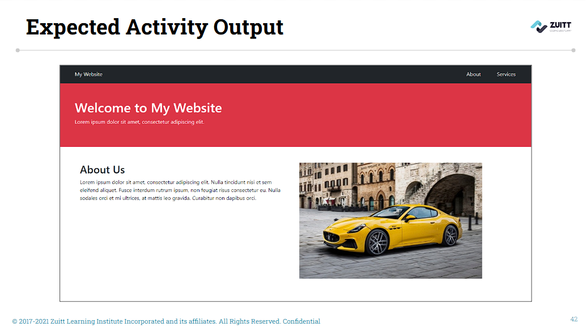
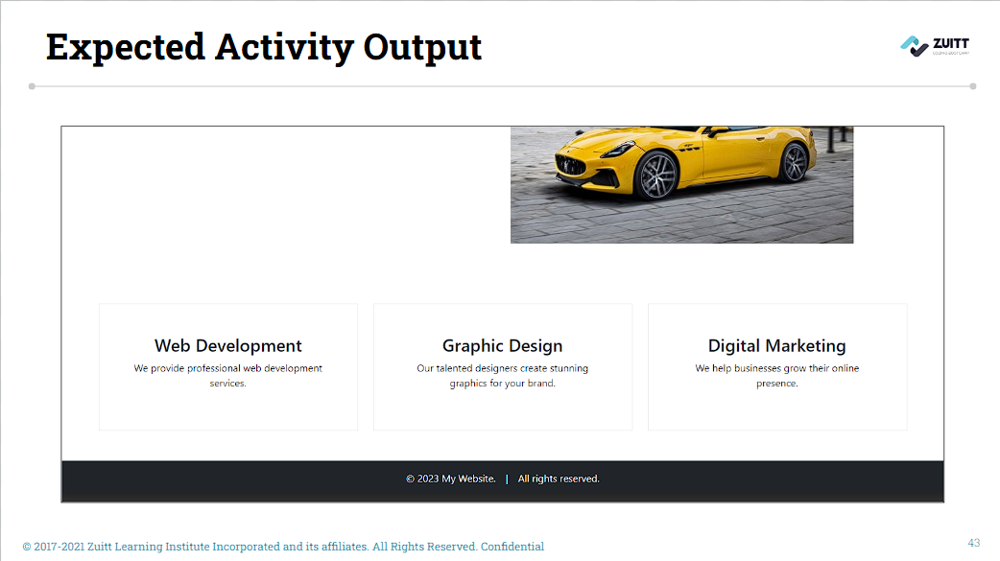

# s17 - Bootstrap - Layout and Best Practices

## Activity - 1 (Quiz)

[s17 - Bootstrap Quiz 1](https://forms.gle/nDkoX6acgd63eFCi7)

## Activity - 2

**Implement Bootstrap** and **apply classes to HTML elements** in order to **create/replicate a simple portfolio**.

### Activity Instructions  

#### Member 1:
1. In the S17 folder, create an activity folder.
- Copy the template provided by your Instructor and paste it in the in the index.html file.
- Update your local groupwork git repository and push to git with the commit message of Add template code s17
2. Apply Bootstrap to the project by adding all the dependencies.
3. Add bootstrap classes to the element "nav” to with the id "navbar":
    - Have all elements to appear as inline elements
    - Add a dark background color with white text
    - Add padding. The horizontal padding should have a greater value than the vertical padding

#### Member 2:
4. Add bootstrap classes to the div element with the id "navlinks":
    - Create space between the navlinks and the "My Website" text using the margin class.
    - Create space between the navlink elements using display grid and gap classes
5. Add bootstrap class to Banner Section with the id "banner":
    - Add a spacing on all sides using padding.
    - Change the background to danger.
    - Change the text to white.

#### Member 3:
6. Add bootstrap classes to the About Section with the id of "about":
    - Add space on top and bottom sides.
    - Divide the columns into two:
        - About Us on the left side. 
        - The image on the right side.
        - Both columns should be equal in size on large screens.

#### Member 4:
7. Add bootstrap classes to the Services Section with the id of "section":
    - Divide the columns into three for the large size screens
    - For md size, equal sizing for the first two columns, and set the last column to full width.
    - Center the text
    - Add border and spacing to the cards

#### Member 5:
8. Add a bootstrap to the Footer Section:
    - Apply a dark background and white text
    - Have all elements to appear as inline elements
    - Add spacing to the elements using display grid and gap classes

#### All Members:
9. Check out to your own git branch with git checkout -b <branchName>
10. Update your local groupwork git repository and push to git with the commit message of Add activity code s17.
11. Add the sessions repo link in Boodle for s17.
---

### Expected Activity Output:
-
-

## Activity Template  
```html
<!DOCTYPE html>
<html lang="en">
    <head>
        <meta charset="UTF-8">
        <!-- Mobile Responsive Meta Tag -->
        <meta name="viewport" content="width=device-width, initial-scale=1.0">

        <title>Bootstrap - Layout and Best Practices</title>

    </head>
    <body>
      <!-- Navbar -->
        <nav id="navbar">
            <div>My Website</div>
            <div id="navlinks">
                <div>About</div>
                <div>Services</div>    
            </div>      
        </nav>

        <!-- Banner Section -->
        <section id="banner">
            <h1>Welcome to My Website</h1>
            <p>Lorem ipsum dolor sit amet, consectetur adipiscing elit.</p>
        </section>


        <!-- About Section -->
        <section id="about">
            <div id="about-row">
                <div id="about-col-1">
                    <h2>About Us</h2>
                    <p>Lorem ipsum dolor sit amet, consectetur adipiscing elit. Nulla tincidunt nisi et sem eleifend aliquet. Fusce interdum rutrum ipsum, non feugiat risus consectetur eu. Nulla sodales orci et mi ultrices, at mattis leo gravida. Curabitur non dapibus orci.</p>
                </div>
                <div id="about-col-2">
                    
                </div>
            </div>
        </section>

        <!-- Services Section -->
        <section id="section">
            <div id="section-row">
                <div id="section-col-1">
                    <div id="section-web-dev">
                        <h3>Web Development</h3>
                        <p>We provide professional web development services.</p>
                    </div>
                </div>

                <div id="section-col-2">
                    <div id="section-design">
                        <h3>Graphic Design</h3>
                        <p>Our talented designers create stunning graphics for your brand.</p>
                    </div>
                </div>

                <div id="section-col-3">
                    <div id="section-marketing">
                        <h3>Digital Marketing</h3>
                        <p>We help businesses grow their online presence.</p>
                    </div>
                </div>
            </div>
        </section>

        <!-- Footer -->
        <footer id="footer">
            <div>&copy;  2023 My Website.</div>
            <div>|</div>
            <div>All rights reserved.</div>
        </footer>
        
    </body>
</html>
```

---

### Activity References
- [Bootstrap Text Utility Classes](https://getbootstrap.com/docs/4.6/utilities/text/)
- [What is Mobile First Design](https://medium.com/@Vincentxia77/what-is-mobile-first-design-why-its-important-how-to-make-it-7d3cf2e29d00)
- [Bootstrap Border Utility Classes](https://getbootstrap.com/docs/5.0/utilities/borders/)
- [Bootstrap Sizing Utility Classes](https://getbootstrap.com/docs/5.0/utilities/sizing/)
- [HTML Blocks - tutorialspoint](https://www.tutorialspoint.com/html/html_blocks.htm)
- [HTML Blocks - w3schools](https://www.w3schools.com/html/html_blocks.asp)
- [HTML Elements](https://developer.mozilla.org/en-US/docs/Glossary/Element)
- [Bootstrap Position Utility Classes](https://getbootstrap.com/docs/5.0/utilities/position/)
- [Bootstrap Spacing Utility Classes](https://getbootstrap.com/docs/5.0/utilities/spacing/)
- [Bootstrap Display Utility Classes](https://getbootstrap.com/docs/5.0/utilities/display/)
- [Bootstrap Image Utility Classes](https://getbootstrap.com/docs/5.0/content/images/)
